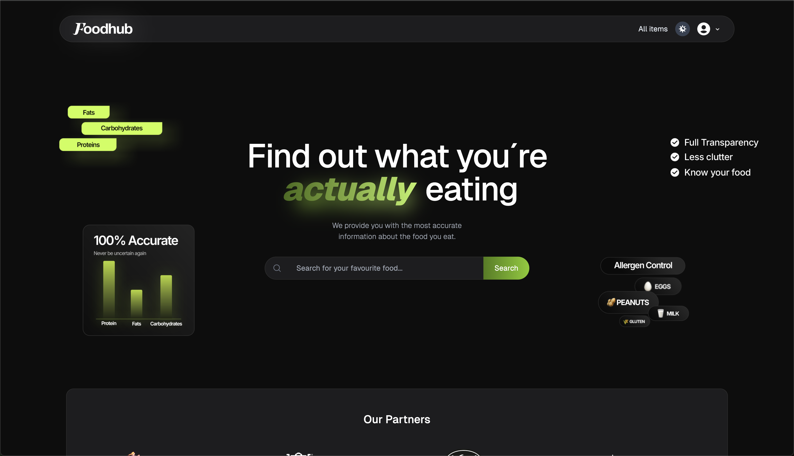
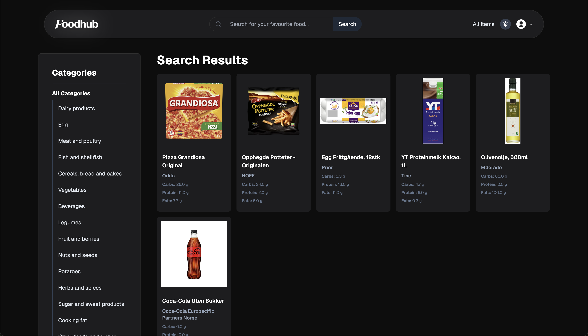
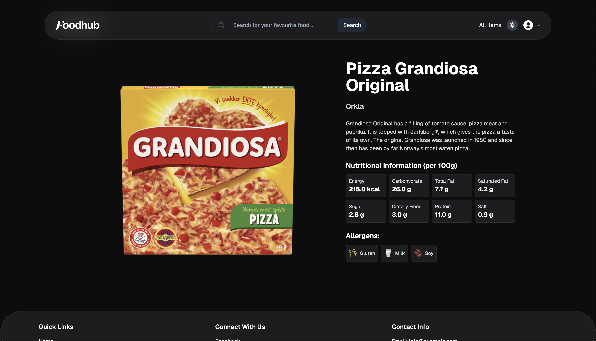
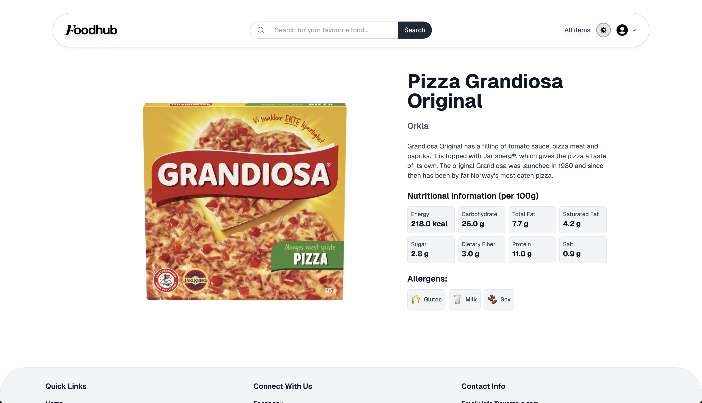
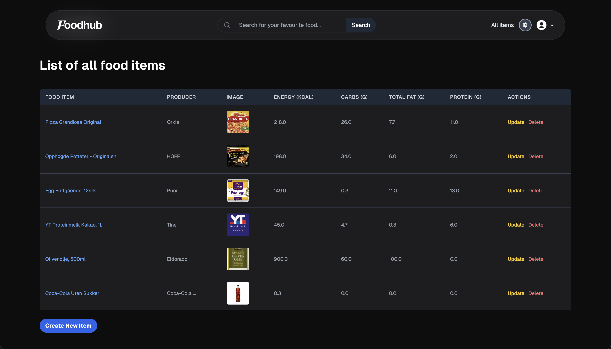
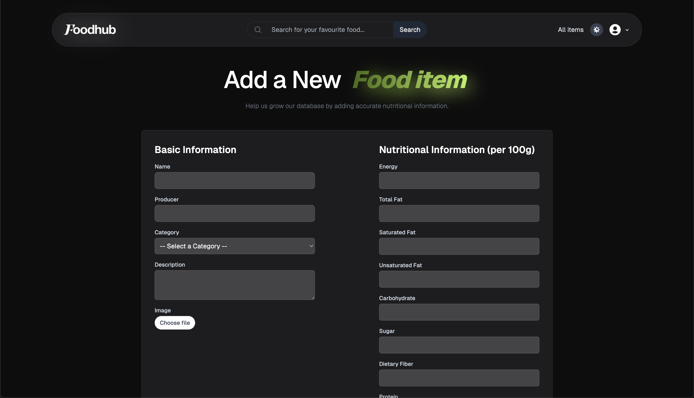
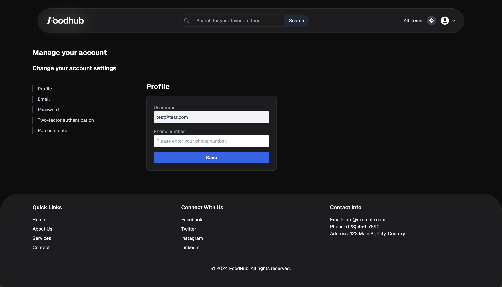
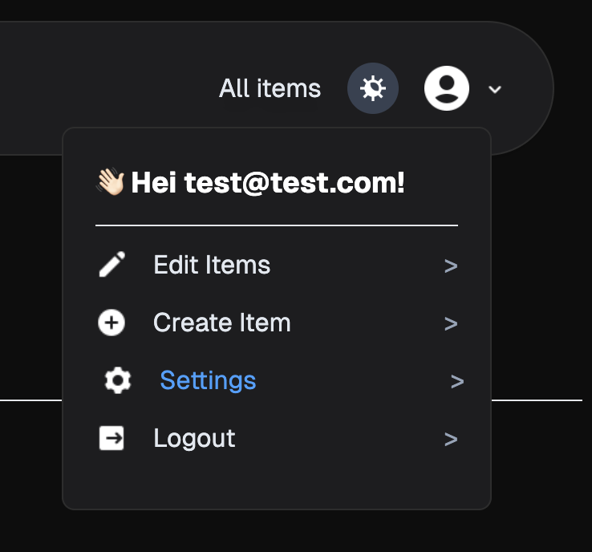

# FoodHub Project

## Project Overview
FoodHub is a web application for exploring and managing food items. It was developed as part of a group exam project, with two versions: one built with .NET and another using React and TypeScript.

## Key Features
- Searchable food database
- Sorting and filtering by food types
- Detailed food item pages (nutritional values, allergies, etc.)
- User authentication and profile management (.NET version only)
- Full CRUD operations for registered users (.NET version)
- Responsive design for various screen sizes

## Technologies Used
- .NET version:
  - ASP.NET Core
  - C#
  - JavaScript
  - HTML/CSS
- React version:
  - React
  - TypeScript
  - Tailwind CSS

## My Contributions
As a member of a four-person team, I took the lead on front-end development, focusing on:
- Overall design and layout
- User experience (UX) design
- JavaScript functionality
- Responsive design implementation
- I also contributed to the back-end functionality and connecting the various parts.

## Screenshots

## Showcasing video
Here´s a quick screen recording showcasing the .NET application functionality.
https://vimeo.com/1057883954/12eadb6666?share=copy

A small version with minimal functionality and no database can be viewed here on github to get a quick understanding of the design and responsiveness.
https://haraldeskeland.github.io/FoodHub/

## Future Improvements
- Implement user authentication in the React version
- Add a favorites or bookmarking system for users
- Ability to filter based by protein amount etc.
- Company users only being able to edit items they´ve uploaded themselves.

## How to Run

### .NET Version
1. Open the "FoodHub" folder in your IDE
2. In the terminal, run: `dotnet build FoodHub.csproj`
3. After building, run: `dotnet run`
4. Open your web browser and navigate to the provided localhost address (default is localhost:3000)

To run tests:
1. Navigate to the FoodHub.Tests folder: `cd FoodHub.Tests`
2. Run: `dotnet test`

### React Version
1. Open the FoodHubReact/foodhub folder in your IDE
2. Install dependencies: `npm install`
3. Start the backend:
   - Ensure your IDE's workspace folder is in the directory above "FoodHubReact"
   - Initialize the debugging tool (F5 on Windows, Fn+F5 on Mac)
4. Start the web application: `npm start`

